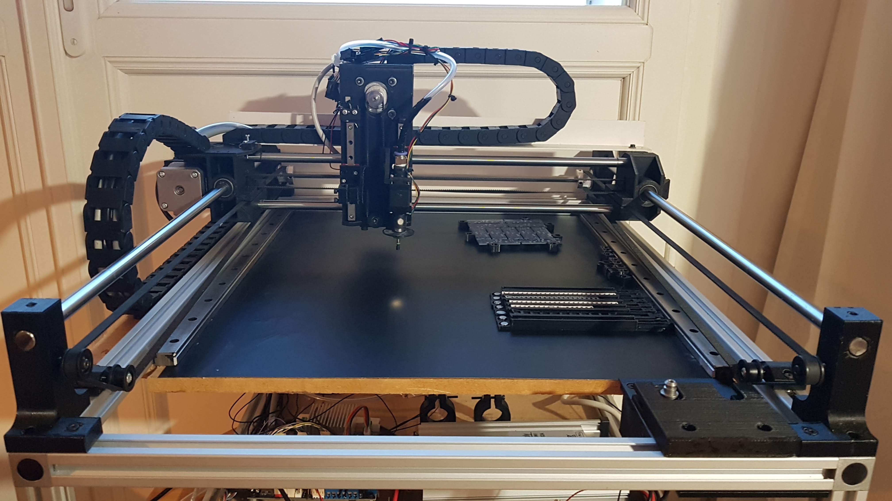

# MICRO Pick and Place (PNP) machine PROJECT 
> Based on 3D printer parts and 2020 aluminium profile

Build from 2020 profile in order to make a chassis of 440 x 600 x 240 mm and working zone of 420 x 280 mm

This project is still a project a work in progress.
This has no commercial purpose, it is only a fun tool.

## BOM
- Printed parts
- 1x NEMA 23
- 1x NEMA 17 48mm
- 1x NEMA 17 34mm (lighter)
- 1x NEMA 8
- lots of D6x2 magnets
- 4x 560mm 2020 slot 6 profile
- 4x 400mm 2020 slot 6 profile
- 4x 200mm 2020 slot 6 profile
- 8x Cube connector 20
- 1x magnetic board
- 8x LM10UU
- 2m dragchain 20x10mm
- 2x D10x600mm rod
- 2x D10x500mm rod
- 1x D8x440mm rod
- 2x MGN7 L100mm with C type carriage
- 2x 720p camera (boards) with modifiable focus
- 2x 50mm led ring 12V
- 2x GT2 pulley 20 teeth D5mm
- 2x GT2 pulley 32 teeth D8
- 6x freewheel GT2 6mm DI 3mm DO 12mm
- 2m GT2 belt
- 1x Coupler D8 D6.35
- 1x NEMA23 Driver
- 1x emotronic board or smoothieware like board
- 1x JUKI head for 1206 and larger IC
- 1x 12V mini vaccum pump 70L / min
- 1x pneufit D6 1/8"
- 2m aquarium tube D6mm
- 120 or 250w 12W power supply
- IEC connector C14 with switch and fuse
- 1x 600x440mm plywood 10mm
- 3D printed parts

## License

Distributed under the GPL license. See ``LICENSE`` for more information.

